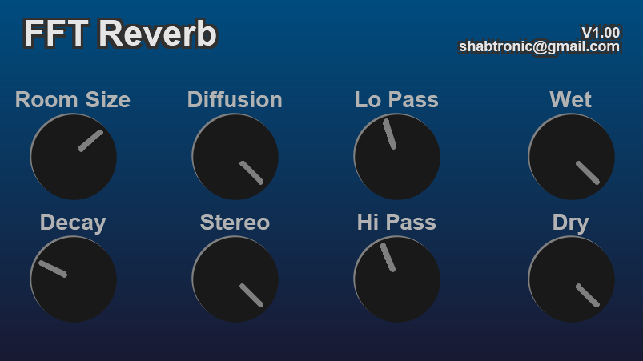

# FFT-Reverb
R&amp;D for a pure FFT based reverb 

## Idea

The initial idea is to leaky integrate a FFT (with a time constant decay), and phase modulate the bins (maybe SHM resonant springs and some sinusoids).

FFT will be overlap and add with a appropriate window.

Hoping that the springs store the historical impulse information and make it sound like a delay based reverb, but without the mode resonance of a delay line.

## Acutal Implementation

Turns out - no need for springs on the phase - just adding random noise to the phase acts as diffusion.
Sounds pretty good all round - super smooth and clean.

With small FFT sizes, it turns into a modulation mess tho!

Implemented with 2 overlapping FFTs, sin window e.t.c.

I choose the next POT FFT size based on the delay/window size.

The difference with a all pass diffuser, is that the all pass system require a ton of iterations/pluming to hide the cyclic phase changes. The FFT doesn't require that - hence
only 1 window's worth of signal can be phase scrambled into a pleasing non-cyclic diffuse sound.

## To do

Add some kind of graph editor, so I can edit the decay of FFT bin frequencies e.t.c. Instead of having a global decay - I could sculpt the decays, probably reverting back to a modal resonance sounding system :)

